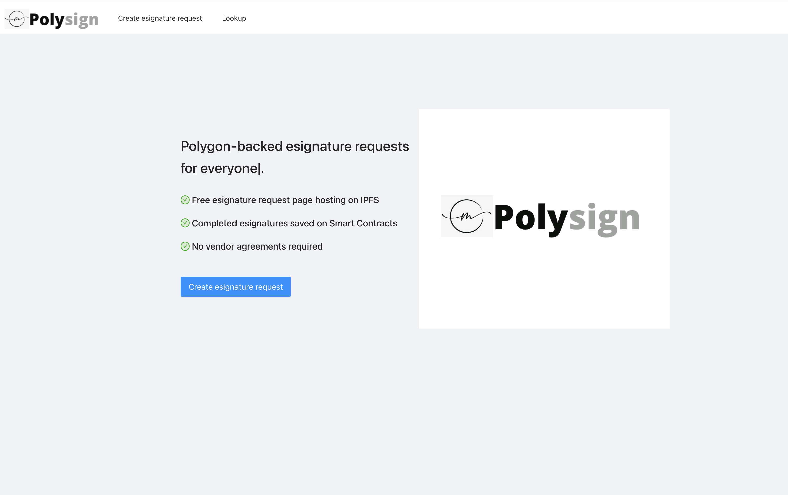
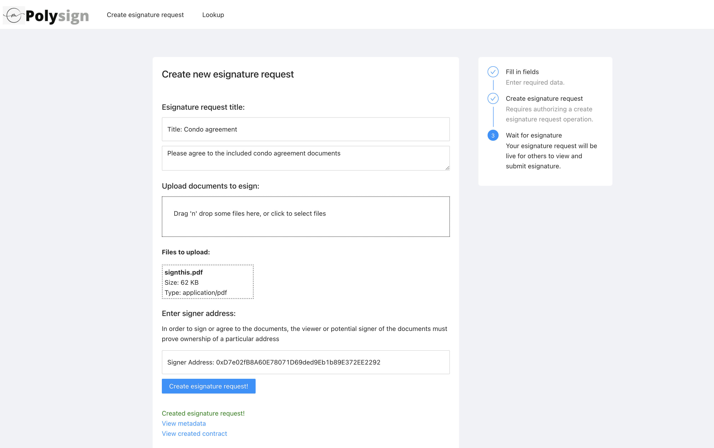
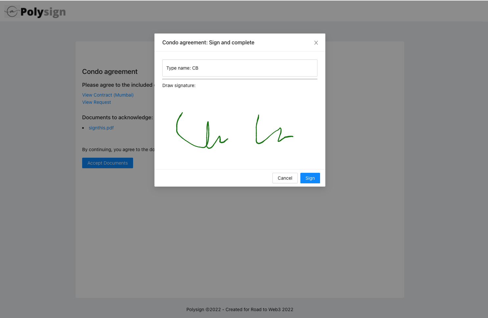
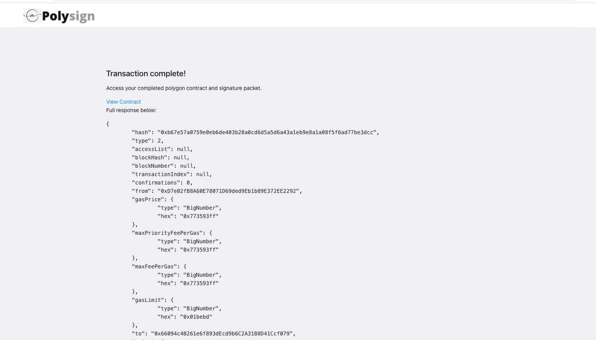

    

Polysign

###

Polysign is a prototype web3 implementation of docusign built on Polygon.

Creates a simple web3 hosted implementation of Docusign.

### Benefits

- Each packet of documents is made accessible at an IPFS url.
- When the esignature is completed, an NFT is generated that links both the canvas signature and the documents being agreed on. The hosted documents are immutable.
- View history of esignature NFT's using covalent directly from the app.
- An individual in the context of the Polysign application is the pairing of a canvas (handwritten) signature and wallet signature/address.

### Technologies used

- Covalent: History queries of past esignatures
- NFTPort: Generation of the esignature record / proof.
- Moralis: Hosting of the document packets per request
- Polygon: Generation of the smart contract fulfilled upon completion/fulfillment of the packet documents signature.

#### Esignature

#### Creating an esignature request contract

### Signing (fulfilling the contract)

<b>This project is a hackathon prototype and would require additional work to be production ready (i.e. around some of the final checkout flows).</b>

### View the esignature result

---

To run/demo the project locally, Polysign requires the following environment variables.

<pre>
    REACT_APP_MORALIS_ID={YOUR_MORALIS_APP_ID} # Moralis app id
    REACT_APP_MORALIS_SERVER={YOUR_MORALIS_SERVER_URL} # Moralis server url
    REACT_APP_COVALENT_KEY={YOUR_COVALENT_API_KEY} # Covalent key for the history page.
    REACT_APP_NFT_PORT_KEY={YOUR_NFT_PORT_API_KEY} # NFT port api key for receipt creation.
</pre>

---

After declaring the above environment variables, use the below command to start the project:

<pre>
yarn
yarn start
</pre>

Recompiling contract:
`cd contracts; npx hardhat compile`

Example esignature requests contracts:
http://localhost:3000/sign/QmUAS9XJyf9gPgadoVeExESiVnVJmVJW6qtcU4dzJzwG96

<!--

Sponsors:
Polygon - Deploys a smart contract for esign
Moralis - Doc storage
Sequence - Polygon contract deploy

Demo flow:
Show docusign site
Show Polysign.
Create an esign request (moralis)
Submit (Can be metamask or sequence wallet)
Show result (moralis, polygon contract)
View the completed assets (polygon, contract interaction, nftport)
Github

-->

### Screenshots

#### Home page

#### Creating a request

### Esigning

### Completion esignature NFT

### Dev Notes

- https://docs.sequence.build/build-with-sequence/connect-wallet

### Useful links

- https://ethglobal.notion.site/Road-to-Web3-Info-Center-ffe7c93baaae4f33b424f9152469e841
- https://showcase.ethglobal.com/roadtoweb3/prizes
